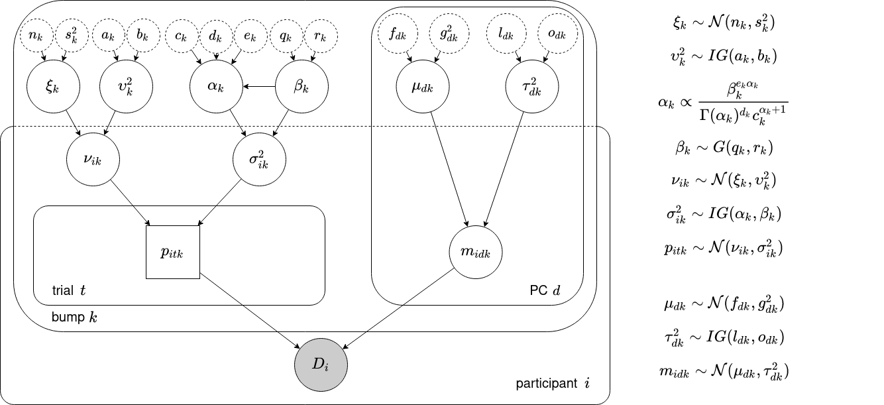

# A hierarchical Gibbs sampler for discovering cognitive stages - extended

This sampler will estimate the parameter values for the hierarchy displayed in the figure below from EEG data.

## Requirements

1. MATLAB 2021a (other versions may work just as well but have simply not been tested)
2. EEGLAB 2021.0 (again, other versions may also work)
3. Preprocessed human EEG data that has been fed through a principal component analysis (PCA), named `varForBumps135_100.mat` and placed in a directory `./data`. It should contain the following variables:
    * `coeff10`: PCA coefficients.
    * `latent10`: PCA eigenvalues.
    * `conds`: A column vector that indicates to what experimental condition every trial belongs.
    * `data`: The (preprocessed) EEG signal, before it has been fed to a PCA.
    * `normedscore10`: The `D` principal components, concatenated for all trials and subjects. If that results in a total of `n` time points, this variable has size [`n` x `D`].
    * `subjects`: A column vector that indicates to what subject every trial belongs.
    * `x`: A column vector that indicates at what index of `normedscore10` every trial started.
    * `y`: A column vector that gives, for every trial, its last index into `normedscore10`.
4. A file `chanlocs.mat`, also placed in `./data`. Contains the EEG channel locations w.r.t. a human's head.
5. (Optional) Synthetic PCA data, placed in `./synth_data`, containing the following variables:
    * `all_signal`: Synthetic version of `normedscore10`.
    * `all_x`: Synthetic version of `x`.
    * `all_y`: Synthetic version of `y`.
    * `all_subjects`: Synthetic version of `subjects`.
    * `all_conds`: Synthetic version of `conds`.

## Setup

Open `main.m`.[^1]

### Paths and variables

1. Change the `path` variable to the directory `main.m` is placed in.
2. Change `save_dir` to where you want to save your data.
3. If you want to analyze synthetic data, change `dataset` to the name of your data file.
4. In the section `%% Checking validity and ...` set the parameters for the number of bumps and subjects you want to analyze.
5. In the section `%% Loading data`, replace `genpath([path 'synth_data'])` with the directory your data are placed in.
6. Replace `[path 'eeglab2021.0']` with the path to your EEGLAB directory.
7. If you want to pick up where you left off in a previous analysis, set `continue_path` to the path that contains the history file generated by that previous analysis. Otherwise, comment it out. Please note that this functionality is still a bit rough around the edges.
8. In the section `%% Setting up variables`, change `max_iter` to your desired maximum number of iterations.
9. Change `cond` to the condition you want to analyse..

## Running the analysis

Simply run `main.m`. Once the run has completed, all sampled parameters will be saved to the `save_dir` directory (with the run number appended to it).

[^1]: You can also choose to run `main_bumps.m` (for the incremental method) or `main_bumps_relative.m` (for the incremental relative method). Most of the paths and parameters still work the same, although you will find that `parameters.n` has been changed to `parameters.max_bumps`. `n` will slowly be increased from 1 to `parameters.max_bumps`: Such increments happen after `max_iter` iterations.